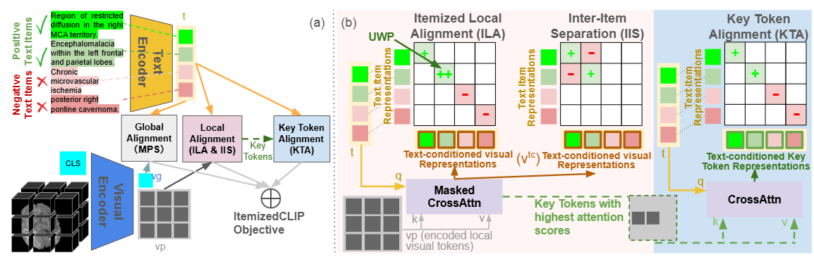

# ItemizedCLIP

This is the code repository for the paper "Learning complete and explainable visual representations from itemized text supervision".

```
Arxiv Coming Soon!
```

### Abstract

Training vision models with language supervision enables general and transferable representations. However, many visual domains, especially non-object-centric domains such as medical imaging and remote sensing, contain itemized text annotations: multiple text items describing distinct and semantically independent findings within a single image. Such supervision differs from standard multi-caption supervision, where captions are redundant or highly overlapping. Here, we introduce ItemizedCLIP, a framework for learning complete and explainable visual representations from itemized text supervision. ItemizedCLIP employs a cross-attention module to produce text item-conditioned visual embeddings and a set of tailored objectives that jointly enforce item independence (distinct regions for distinct items) and representation completeness (coverage of all items). Across four domains with naturally itemized text supervision (brain MRI, head CT, chest CT, remote sensing) and one additional synthetically itemized dataset, ItemizedCLIP achieves substantial improvements in zero-shot performance and fine-grained interpretability over baselines. The resulting ItemizedCLIP representations are semantically grounded, item-differentiable, complete, and visually interpretable.



Below are the detailed instructions on how to train/evaluate models with this repository on all 5 domains that we have conducted experiments on in this paper.

## Whole-study brain MRI (UM220K)

### Dataset Download

The training data, UM220K, has restricted access due to patient privacy protection. Pub-brain-5 dataset (which we used as evaluation) is publicly available, and you may download the dataset following the instructions [here](https://github.com/Zch0414/hlip/tree/master/data). 

### Training

To train ItemizedCLIP on your MRI dataset, you first need to process your dataset into the following directory format:
```
mri-root-directory
    |--STUDY000001     # one whole-study
    |   |--AX_FLAIR    # First sequence
    |   |   |--img.pt  # Float Tensor of size 48x256x256
    |   |
    |   |--AX_T2       # Second sequence
    |   |   |--img.pt  # Float Tensor of size 48x256x256
    |   |
    |   |   ...
    |
    |--STUDY000002     # second whole-study
    |   |-- ...        # sequences of the second study
    |   
    ...
```

You must also create 2 json files called `train.json` and `valid.json` containing information about the training and validation studies. Each json must have the following format:

```
{
    "STUDY000001": { # replace this with your study name
        "series": {
            "AX_FLAIR": {}, # first sequence of STUDY000001
            "AX_T2":{},     # second sequence of STUDY000001
            ...
        }
        "report": [
            "report item 1",
            "report item 2",
            ...
        ]
    }
    "STUDY000002":{
        ...
    }
    ...
}
```
Then, in `Radiology_Tasks/src/open_mri_train/data.py` lines 9 and 11, set `DATA_ROOT_PATH` to path to your "mri-root-directory", and set `JSON_ROOT_PATH` to the folder that contains your `train.json` and `valid.json`. Then, you may run the training script with the following command: 

```
bash train_mri.sh
```

The checkpoints and logs will be saved at the directory where `--logs` in the bash script specifies. You may modify it if you want to store your logs and checkpoints elsewhere.

### Evaluation on Pub-brain-5

To evaluate a trained model on Pub-brain-5, use the following command: 
```
cd Radiology_Tasks/src/open_mri_test

python3 zero_shot_pub_brain_5.py --resume /path/to/your/checkpoint/epoch_X.pt --input-filename pub_brain_5.csv --data-dir /path/to/where/you/downloaded/pub-brain-5/data  # This runs pub-brain-5

python3 zero_shot_pub_brain_5.py --resume /path/to/your/checkpoint/epoch_X.pt --input-filename pub_brain_5_gt.csv --data-dir /path/to/where/you/downloaded/pub-brain-5/data  # This runs pub-brain-5-gt
```

### Trained Checkpoint downloading

The checkpoint we trained that was used for all evaluations in our paper for brain MRI is available [here](https://drive.google.com/file/d/1VnyzJ1-m6Belj9YjNjCP_4-z-9r09h77/view?usp=sharing).

## Whole-study brain CT (HeadCT240K)

### Dataset Download

The training data, HeadCT240K, has restricted access due to patient privacy protection. RSNA and CQ500 (which we used as evaluation) is publically available, and you may download the dataset following instructions [here](https://github.com/Zch0414/hlip/tree/master/data). 

### Training

To train ItemizedCLIP on your CT dataset, you first need to process your dataset into the following directory format:
```
ct-root-directory
    |--STUDY000001     # one whole-study
    |   |--HEAD_PROTOCOL_BloodView    # First sequence
    |   |   |--img.pt  # Float Tensor of size 48x256x256
    |   |
    |   |--HEAD_PROTOCOL_BrainView       # Second sequence (each view is treated as different sequence)
    |   |   |--img.pt  # Float Tensor of size 48x256x256
    |   |
    |   |   ...
    |
    |--STUDY000002     # second whole-study
    |   |-- ...        # sequences of the second study
    |   
    ...
```

You must also create 2 json files called `train.json` and `valid.json` containing information about the training and validation studies. Each json must have the following format:

```
{
    "STUDY000001": { # replace this with your study name
        "series": {
            "AX_FLAIR": {}, # first sequence of STUDY000001
            "AX_T2":{},     # second sequence of STUDY000001
            ...
        }
        "report": [
            "report item 1",
            "report item 2",
            ...
        ]
    }
    "STUDY000002":{
        ...
    }
    ...
}
```
Then, in `Radiology_Tasks/src/open_mri_train/data.py` lines 9 and 11, set `CT_ROOT_PATH` to path to your "ct-root-directory", and set `CT_JSON_ROOT_PATH` to the folder that contains your `train.json` and `valid.json`. Then, you may run the training script with the following command: 

```
bash train_ct.sh
```

The checkpoints and logs will be saved at the directory where `--logs` in the bash script specifies. You may modify it if you want to store your logs and checkpoints elsewhere.

### Evaluation on RSNA and CQ500

To evaluate a trained model on RSNA and CQ500, use the following command: 
```
cd Radiology_Tasks/src/open_mri_test

python3 zero_shot_rsna.py --resume /path/to/your/checkpoint/epoch_X.pt --data-dir /path/to/where/you/downloaded/rsna/data --use-serienames  # This runs rsna zero-shot

python3 zero_shot_pub_brain_5.py --resume /path/to/your/checkpoint/epoch_X.pt --data-dir /path/to/where/you/downloaded/cq500/data --use-serienames # This runs cq500 zero-shot
```

### Trained Checkpoint downloading

The checkpoint we trained that was used for all evaluations in our paper for brain CT is available [here](https://drive.google.com/file/d/1OjbZy5t4c8afgmrDC5kg1zMg_nsVeeOD/view?usp=sharing).

## Single-sequence (CT-Rate)

### Dataset Download

To download the data for CT-Rate (for training and internal evaluation) and Rad-ChestCT (for external evaluation), follow instructions from HLIP repository [here](https://github.com/Zch0414/hlip/tree/master/data).

### Training

The training command for CT-Rate is available in `train_ctrate.sh`. Before training, you need to modify `Radiology_Tasks/src/open_ct_rate/data_chest_ct.py`: replace the `DATA_ROOT` in line 19 with where you stored your downloaded CT_Rate dataset. Then, run the following command:

```
bash train_ctrate.sh
```

### Evaluation

To evaluate a trained model on CT-Rate validation set or Rad-ChestCT, run the following commands:

```
cd Radiology_Tasks/src/open_ct_rate

# CT-Rate zero-shot
zeroshot_ct_rate.py --resume /path/to/your/checkpoint/epoch_X.pt --data-root /path/to/where/you/downloaded/ctrate/data

# Rad-ChestCT zero-shot
zeroshot_rad_chestct.py --resume /path/to/your/checkpoint/epoch_X.pt --data-root /path/to/where/you/downloaded/radchestct/data
```

### Trained Checkpoint Downloading

The checkpoint we trained that was used for all evaluations in our paper for chest CT is available [here](https://drive.google.com/file/d/1Mo2PhqYzSriGTrWcI5opfj-fAZuYRY2C/view?usp=sharing).

## Remote Sensing (RSICD)

### Dataset Download

The RSICD dataset is available at https://www.kaggle.com/datasets/thedevastator/rsicd-image-caption-dataset. Please download `train.csv`, `valid.csv` and `test.csv` and put them in a folder on your device (we will refer to this folder as `rsicd_path`).

You also need to download the classification labels [here](https://drive.google.com/file/d/13An1cKhdztCXBkoEmc1c1Lo1kqZKo3Ur/view?usp=sharing), and place it in the same folder (`rsicd_path`).

In addition, you need to download the deduplicated text items for train and test splits from [here](https://drive.google.com/drive/folders/15FzjyBTY2Mf3XjIm-6zvKdYFclDAt_dO?usp=sharing).

### Training

The training command for RSICD is available in `train_rsicd.sh`. Before training, you need to modify `--rsicd-data-dir` to your `rsicd_path`, and edit `--external-captions` to the paths to where you stored the deduplicated text items (`trainv1.json` and `testv1.json`). In addition, edit the `--logs-dir` to a path where you want all the training logs and checkpoints stored. Adjust the GPU allocation and usage based on your server's GPU availabilities. Then, you may run the training script with the following command:

```
bash train_rsicd.sh
```

The checkpoints and logs will be saved at the directory where `--logs` in the bash script specifies. You may modify it if you want to store your logs and checkpoints elsewhere.

### Classification Evaluation

The evaluation command for RSICD 30-class classification evaluation is available in `inference_rsicd_classification.sh`. Before running the evaluation, you need to modify `--resume` with the path to your saved checkpoint (likely inside your `--logs-dir` specified during training), and modify `--rsicd-data-dir` to your `rsicd_path`. Then, you may run the evaluation script with the following command: 

```
bash inference_rsicd_classification.sh
```

### Visualization

To generate attention-map visualizations for RSICD, modify `--resume` in `visualize_rsicd.sh` to the path of your saved model checkpoint, and modify `--external-captions` to the paths to where you stored the deduplicated text items (`trainv1.json` and `testv1.json`). Then, run the following command: 

```
bash visualize_rsicd.sh
```

And the visualization result should appear within `2D_images_tasks/src/visualize/visualizations`

### Trained Checkpoint downloading

The checkpoint we trained that was used for all evaluations in our paper for remote sensing is available [here](https://drive.google.com/file/d/1wj6Ledu6WmDpwMxfw_dz-7pSCOgf11mC/view?usp=sharing).

## Natural Images (Itemized-cc0.3M)

### Dataset Download

To download the processed shards for Itemized-cc0.3M, download the entire folder from [here](https://drive.google.com/drive/folders/1LfqD7H2Aom_x6uZrQsrOEdKqUfgaruwL?usp=sharing). This folder contains the image shards for Itemized-cc0.3M dataset. The itemized text is stored in `2D_images_Tasks/first_300000_rewrites.json`.

To download and process the evaluation datasets (MSCOCO and Flickr), follow instructions from the original FLAIR paper's [repository](https://github.com/ExplainableML/flair/blob/main/datasets/EVAL_DATASETS.md).

### Training

The training script for training an ItemizedCLIP model on Itemized-cc0.3M dataset is in `train_itemized_cc0.3M.sh`. You must first replace several configs within the file: modify `--train-data` and `--val-data` to the directory containing all the image shards for Itemized-cc0.3M dataset. Modify `--logs-dir` to where you want the log files and checkpoints to be stored. Then, run the following command:

```
bash train_itemized_cc0.3M.sh
```

### Retrieval Evaluation

To perform retrieval evaluation on MSCOCO, first modify `--coco-data-root-dir` in `inference_coco.sh` to where you stored the downloaded MSCOCO data files, and then modify `--resume` to your checkpoint. Then, run the following commands:

```
bash inference_coco.sh
```

To perform retrieval evaluation on Flickr, first modify `--flickr-data-root-dir` in `inference_flickr.sh` to where you stored the downloaded Flickr data files, and then modify `--resume` to your checkpoint. Then, run the following commands:

```
bash inference_flickr.sh
```

### Trained Checkpoint downloading

The checkpoint we trained that was used for all evaluations in our paper for Natural Images is available [here](https://drive.google.com/file/d/1N_YEXNcN0-QhWZhtJOyA3-h2_zYXycG_/view?usp=sharing).
